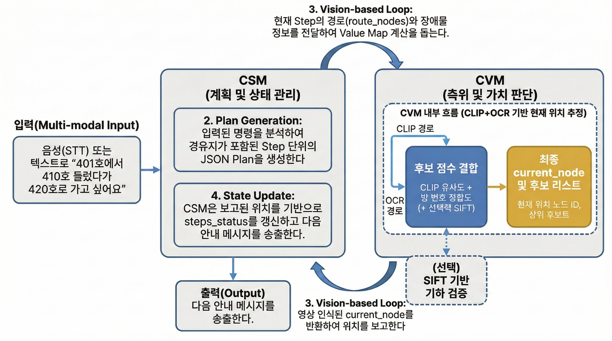

# CSM (Constraint-Aware Sub-instruction Manager)

[](https://www.python.org/)
[]()
[]()

> **An intelligent navigation sub-system that manages complex routing plans and real-time state transitions for GPS-denied indoor environments.**

## Overview

**CSM (Constraint-Aware Sub-instruction Manager)** is the core logic module for our vision-based indoor navigation project. It bridges the gap between natural language user commands and the visual positioning system (**CVM** - Constraint-Aware Value Mapper).

The primary goal of CSM is to generate a precise, constraint-aware multi-step **Plan** and manage the execution of **Sub-instructions** in real-time. By providing detailed trajectory data (`route_nodes`) to the vision module, it enables the **Value Map v2 algorithm** to calculate optimal movement directions even in complex indoor structures where GPS signals are unavailable.

---

## System Architecture



CSM orchestrates the entire navigation sequence, acting as the control tower between the user input and the vision-based positioning engine.

## Core Workflow

1. **Multi-modal Input**

   - Receives complex commands (e.g., _"Go to Room 420 via Room 410"_).

2. **Plan Generation (CSM)**

   - Analyzes the command and generates a JSON Plan consisting of sequential **Steps**.

3. **Vision-Logic Loop (CSM ↔ CVM)**

   - **CSM → CVM**: Sends the `route_nodes` (trajectory) and constraints for the current step to assist Value Map calculation.
   - **CVM → CSM**: Returns the recognized `current_node` based on visual positioning.

4. **State Update**
   - Updates `steps_status` (PENDING / IN_PROGRESS / DONE) based on location feedback and triggers the next guidance message.

## Key Features & Logic

### 1. Sub-instruction Generation

CSM breaks down complex user commands into minimum executable units called **Steps**.

- **Command Decomposition**:
  - **Input**: "Go to Room 420 via Room 410."
  - **Logic**: Identifies Start (401), Waypoint (410), and Goal (420).
  - **Output**:
    - `Step 1`: Start Recognition (at 401).
    - `Step 2`: Move to Waypoint (401 → 410).
    - `Step 3`: Move to Destination (410 → 420).

### 2. CVM Value Map v2 Integration

CSM provides not just the destination, but the **specific trajectory** to the CVM module.

- **Route Nodes**: A list of specific node IDs (e.g., `[401, 4102, 4201, 4101, 410]`) is injected into the CVM.
- **Scoring Mechanism**:
  - CVM uses this list to calculate the **Value Map v2**.
  - **Reward (+)**: Given to directions aligning with `route_nodes`.
  - **Penalty (-)**: Given to directions deviating from the path.
- **Constraint Handling**: If `avoid_stairs: true` is set, CSM generates a detour path excluding stair nodes before sending it to CVM.

### 3. Robust Runtime State Machine

Implements a logic-based state transition system to handle the fluctuations of vision-based positioning.

- **State Tracking**: Manages `step_status` for the entire sequence.
  - `PENDING`: Future steps.
  - `IN_PROGRESS`: Currently active step.
  - `DONE`: Completed steps.
- **Transition Logic**:
  - Continuously monitors `current_node` from CVM.
  - If `current_node` matches the `target_nodes` of the active step, the system transitions the state to `DONE` and activates the next step.

### [Optional] Fine-tuned LLM Engine (Qwen2.5-1.5B)

CSM utilizes **Qwen2.5-1.5B-Instruct** as its core Natural Language Understanding (NLU) engine.

- **Model**: [Qwen2.5-1.5B-Instruct](https://huggingface.co/Qwen/Qwen2.5-1.5B-Instruct)
- **Fine-tuning**: The model has been fine-tuned on a custom dataset of indoor navigation commands to ensure:
  - Precise extraction of spatial constraints (e.g., "avoid stairs").
  - Strict adherence to the system's **JSON Output Schema**.
  - Robust handling of multi-step routing instructions (Start → Via → Goal).

## Data Interface Specification

Data Interface Specification

<b>CSM enforces a strict JSON format to ensure synchronization between the Logic Layer, UI, and Vision Layer.</b>

```JSON
{
  "constraints": {
    "use_elevator_only": false,
    "avoid_stairs": true
  },
  "current_step": 2,
  "steps_status": {
    "1": "DONE",
    "2": "IN_PROGRESS",
    "3": "PENDING"
  },
  "steps": [
    {
      "step_id": 2,
      "goal_type": "ROOM",
      "goal_room": 410,
      "description": "Move from 401 to Room 410",
      "target_nodes": [410],
      "route_nodes": [401, 4102, 4201, 4101, 410],
      "allowed_moves": ["CORRIDOR", "ELEVATOR"]
    }
  ]
}
```

### Key Fields

| Field             | Type      | Description                                                                                                                          |
| :---------------- | :-------- | :----------------------------------------------------------------------------------------------------------------------------------- |
| `step_id`         | Integer   | Unique identifier for the instruction step.                                                                                          |
| `goal_room`       | Integer   | The final destination of the specific step.                                                                                          |
| `target_nodes`    | List[Int] | The trigger nodes that define the completion of the step.                                                                            |
| **`route_nodes`** | List[Int] | **[Critical]** The sequence of nodes representing the planned path. Used by CVM for Value Map calculation. Matches CSV Map Data IDs. |
| `steps_status`    | Dict      | Real-time progress tracker used for UI updates.                                                                                      |

## Project Structure

```bash
.
├── caainp_csm/                  # Main System Package (Core Logic)
│   ├── manager/                 # Plan Generation & State Management
│   └── utils/                   # Helper functions
├── Qwen2.5-1.5B-Instruct/       # Fine-tuned LLM Directory
│   ├── configs/                 # Training configurations
│   ├── data/                    # Fine-tuning Datasets
│   │   ├── dataset_info.json    # Dataset metadata
│   │   └── indoor_nav.jsonl     # Custom indoor navigation instruction dataset
│   ├── output/                  # Model Checkpoints & Adapters
│   ├── train_model.py           # Fine-tuning execution script
│   ├── config.json              # Model architecture config
│   ├── tokenizer.json           # Tokenizer files
│   └── vocab.json               # Vocabulary file
├── test_plan.py                 # Testing script for Plan Generation
├── pyproject.toml               # Project dependencies configuration (uv)
├── uv.lock                      # Dependency lock file
└── README.md                    # Project Documentation
```

## Getting Started

### Prerequisites

- Python 3.8 or higher
- Connection to CVM module (or use the included Mock CVM for testing)

### Installation

```bash
git clone [https://github.com/caainp/caainp-csm.git](https://github.com/caainp/caainp-csm.git)
cd caainp-csm
pip install -r requirements.txt
```

### Usage Example

```python
from src.core.planner import CSM

# 1. Initialize CSM with map data
csm_system = CSM(map_path="data/map_nodes.csv")

# 2. Process a User Command
command = "I want to go to room 420 via room 410"
plan = csm_system.generate_plan(command)

# 3. Simulate Loop (Interaction with Vision System)
# Assume CVM detects we are currently at node 4102
current_vision_node = 4102

# Update state based on vision feedback
status_update = csm_system.update_state(current_vision_node)

print(f"Current Status: {status_update['steps_status']}")
# Output: {1: 'DONE', 2: 'IN_PROGRESS', 3: 'PENDING'}
```

## Related Projects

- **CVM (Constraint-Aware Value Mapper)**: [Link to Repository]  
  The vision and value map calculation module.

- **Map Data Specification**:  
  Shared CSV format defining the topology of the indoor environment.
